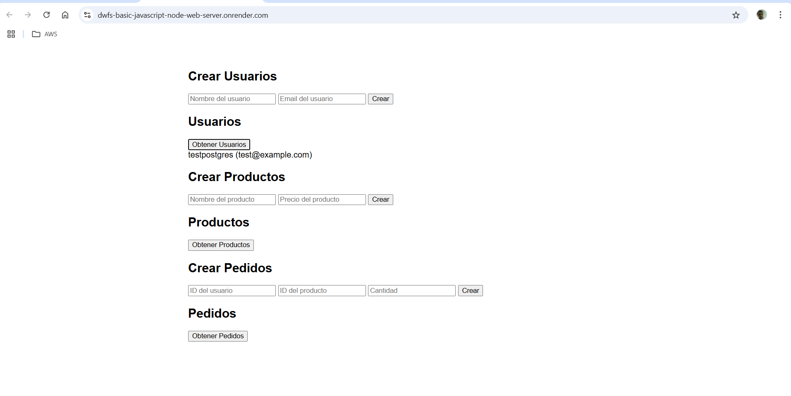

# Welcome Node express web server and backend!


## Getting Started

### Installation

Install the dependencies:

```bash
npm install
```

### Development

Start the development server:

```bash
npm run dev
```

Your application will be available at `http://localhost:3000`


#### Env File

You are going to need a `.env` file like this one:

```bash
APP_HOST=http://your-app-host.com
APP_PORT=your-port
API_HOST=your-api-host.com
API_DB=your DB-type: mysql, postgres, etc
API_NAME=your-db-name
API_KEY=your-db-user
API_SECRET=your-db-password
API_PORT=your-db-port
```

### Deployment CI/CD

- Render.com - Github integration

### Demo:

- Stage: https://dwfs-basic-javascript-node-web-server.onrender.com/